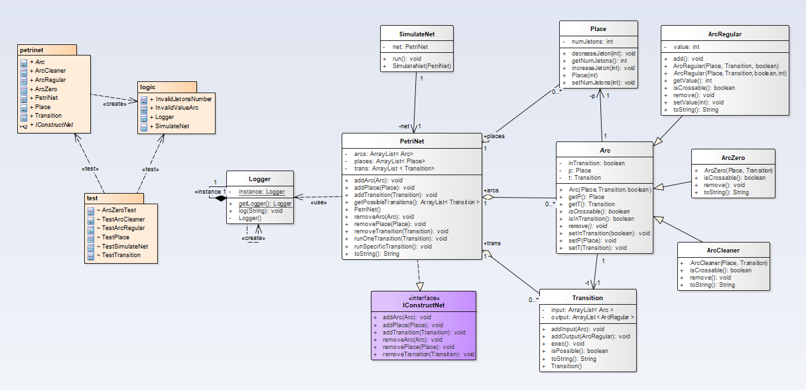

# Simulator Petri Nets

## Description
This project implements the logit to run a Petri Net

## Models



#### Note: the associations  PetriNet --> Place and PetriNet --> Arc, are not used, however help to clarify the model

## How to run? 

### In Eclipse
To test the model, right click on the file, choose "run as", then "JUnit test" (or press Alt+Shift+x then T). Test results will be displayed in a new window.
To launch a complete automatic (random) simulation example, simply run the file logic.SimulateNet (or press F11). Results will be displayed in the console.

### In Console 

```sh
> java -cp .:/usr/share/java/junit.jar org.junit.runner.JUnitCore [test class name]
```

## Authors
Daniel Santos and Guillem Sanyas


